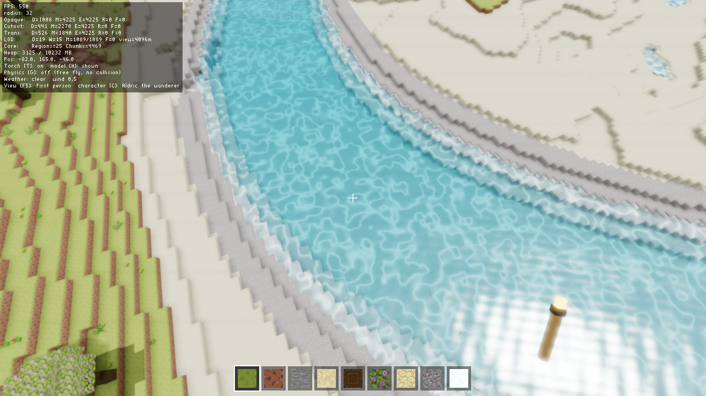
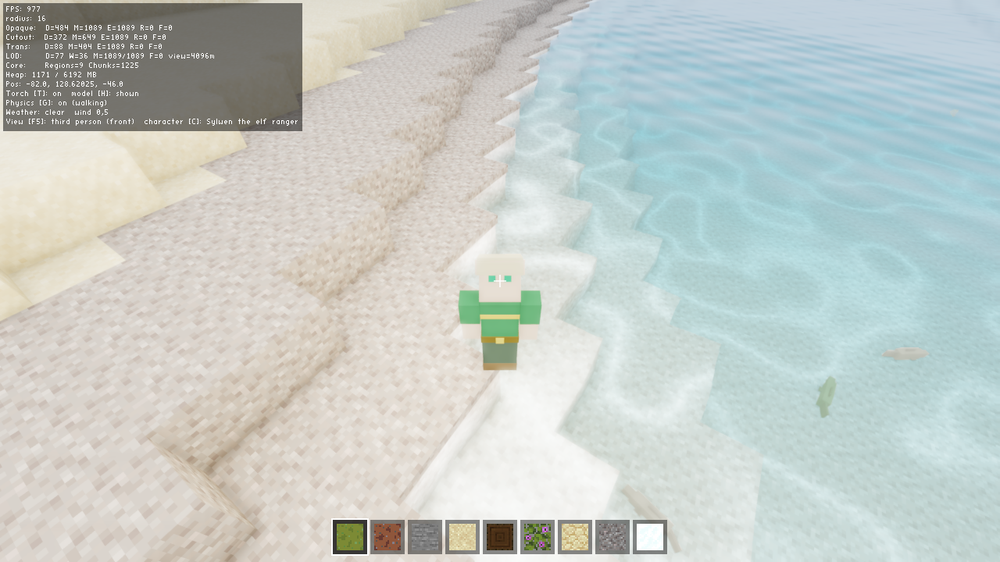
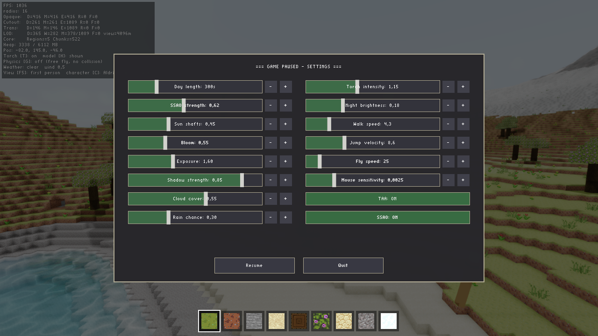

# Voxel Horizon Java Edition - Wiki

Welcome to the **Voxel Horizon Java Edition** project wiki! This is a comprehensive documentation for a production-grade Minecraft-like voxel engine built with Java 21 and LWJGL (OpenGL).

## Project Overview

**Voxel Horizon** is a voxel-based game engine designed with clean architecture principles from day one. The engine features:

- ✅ **Infinite world** with region-based streaming and deterministic generation (seed + coordinates only)
- ✅ **9 biomes**, rivers, oceans, mountain ranges — plus **classic worm-carver caves** with surface and underwater entrances
- ✅ **Modern GL 4.6 renderer**: multi-draw-indirect mesh arenas (single-digit draw calls/frame), HDR + TAA + SSAO + bloom, 3× 4096px soft-shadow cascades, volumetric sun shafts, SSR water with refraction/caustics
- ✅ **Far-field LOD** rings out to 4km (Distant Horizons style)
- ✅ **Day/night cycle, weather** (rain/snow fronts, wind, lightning) and **ambient life** (3D fish, bird flocks, falling leaves)
- ✅ **Playable characters**: physics (gravity, jumping, swimming), third-person avatars (human/elf), handheld torch
- ✅ **Block breaking/placing** with hotbar, and a mouse-driven pause menu with live-tunable settings
- ✅ **Engine-agnostic world data** (core module has zero rendering code)

## Quick Links

### For Developers
- **[Architecture](Architecture.md)** - System design, modules, and clean architecture principles
- **[Rendering Deep-Dive](Rendering-Deep-Dive.md)** - Frame anatomy, MDI arenas, lighting, water, post stack
- **[Interfaces](Interfaces.md)** - Core interfaces and their contracts
- **[Implementation](Implementation.md)** - Detailed implementation guide
- **[Technical Reference](Technical-Reference.md)** - Data structures, constants, and coordinate systems

### For Users
- **[Getting Started](Getting-Started.md)** - Build, run, and basic controls
- **[Gameplay Features](Gameplay-Features.md)** - Current features and gameplay mechanics
- **[Configuration Guide](Configuration-Guide.md)** - Customizing world generation and biomes

### For Contributors
- **[Work in Progress](Work-In-Progress.md)** - Current development status and roadmap
- **[Contributing](Contributing.md)** - How to contribute to the project

## Project Philosophy

This engine is built as a **data-pipeline + streaming system**, not a fixed world window. Key principles:

1. **No Global State** - All generation is pure and deterministic
2. **Region-Based Paging** - Data is generated per region and cached
3. **Renderer Independence** - Renderer can request any chunk at any time
4. **Safe Fallbacks** - Core always answers without throwing bounds exceptions
5. **Separation of Concerns** - NO OpenGL code outside renderer module

## Technology Stack

- **Language**: Java 21
- **Graphics**: LWJGL 3 (OpenGL 4.6 core)
- **Build System**: Gradle with Kotlin DSL
- **Noise Library**: FastNoiseLite (OpenSimplex2)
- **Math Library**: JOML (Java OpenGL Math Library)

## Module Structure

```
voxel-horizon-java-edition/
├── app/          # Entry point, wires core ↔ renderer
├── core/         # World generation, streaming, data model (NO rendering)
├── renderer/     # LWJGL implementation (replaceable)
└── shared/       # Cross-module constants
```

## Current Status

The engine is in **active development** with a stable foundation:

- ✅ **Core architecture** - Complete and production-ready
- ✅ **Terrain generation** - Configurable multi-biome system, rivers, caves
- ✅ **Rendering** - GL 4.6 multi-draw-indirect, HDR post stack (TAA/SSAO/bloom/volumetrics), cascaded soft shadows, LOD to 4km
- ✅ **Streaming** - Thread-safe region caching; 250-350 FPS at 48-chunk radius
- ✅ **Gameplay** - Physics + swimming, block edit with session persistence, hotbar, pause menu, day/night + weather + ambient life
- 📋 **Future work** - World save/load, audio, crafting/inventory, mobs

## Screenshots







## Community

- **GitHub**: [Aizen93/voxel-horizon-java-edition](https://github.com/Aizen93/voxel-horizon-java-edition)
- **Issues**: [Report bugs or request features](https://github.com/Aizen93/voxel-horizon-java-edition/issues)

## License

**MIT** — free and open source; use, modify and redistribute as you like
(see the [LICENSE](https://github.com/Aizen93/voxel-horizon-java-edition/blob/main/LICENSE) file).

---

**Last Updated**: 2026-07-08  
**Version**: feature/unreal-engine branch
